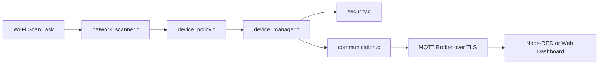
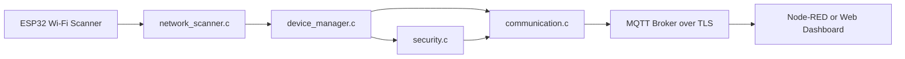

# Rogue Device Detection and Secure Monitoring System

An ESP32-based embedded security project that detects unauthorized wireless devices, evaluates them against a trusted whitelist, and reports alerts securely over MQTT/TLS.
Built as a portfolio-ready demonstration of embedded systems design, wireless monitoring, and practical device-authentication logic for enterprise and industrial environments.

## Why This Project Stands Out
This is not a generic IoT dashboard. It is a security-focused monitoring system designed around real operational constraints:

- Detects rogue or unknown wireless devices in the environment
- Validates trusted assets using exact MAC matching and vendor OUI checks
- Flags suspicious behavior such as RSSI spikes, device flapping, and trusted-device disappearance
- Publishes alerts over MQTT with TLS for secure telemetry transport
- Uses FreeRTOS tasks and modular firmware boundaries for maintainability

## Problem It Solves
Factories, offices, and OT networks are often exposed to unauthorized access points, contractor hotspots, or mislabeled wireless devices. These devices can weaken segmentation, complicate incident response, or become an entry point for lateral movement.

This system provides low-cost wireless visibility using embedded hardware and turns scan data into actionable security alerts.

## Platform Summary
- Target: ESP32
- Framework: ESP-IDF 5.x
- RTOS: FreeRTOS
- Transport: MQTT over TLS
- Output: JSON security alerts

## Architecture



## Firmware Design
The firmware is split into small modules so each concern stays isolated:

- `main/app_main.c` handles boot, Wi-Fi bring-up, and task orchestration
- `main/network_scanner.c` performs active Wi-Fi scans and normalizes observations
- `main/device_policy.c` evaluates observations against the whitelist
- `main/device_manager.c` maintains device state and generates alerts
- `main/security.c` provides MAC validation, OUI checks, and anomaly helpers
- `main/communication.c` publishes JSON alerts over MQTT/TLS
- `main/example_whitelist.c` contains a sample trusted-device list

## Detection Logic
The project uses layered detection instead of a single allow/deny check:

1. Unknown device detection
  - Raises an alert when no whitelist entry matches the observed MAC.

2. Spoofing suspicion
  - Flags devices whose MAC matches a trusted vendor OUI but not the exact approved asset.

3. RSSI anomaly detection
  - Detects trusted devices that move outside their expected radio range.

4. Flapping detection
  - Flags devices that repeatedly disappear and reappear across scan cycles.

5. Trusted-device absence
  - Reports when a known device stops appearing for multiple scans.

## Example Alert Payload

```json
{
  "alert": "unknown_device",
  "mac": "XX:XX:XX:XX:XX:XX",
  "rssi": -70,
  "details": "Device is not present in the whitelist",
  "scan_index": 12
}
```

## Whitelist Strategy
The sample whitelist combines exact device identity with vendor patterns:

- Exact MAC entries for approved assets
- OUI prefixes for validating trusted hardware families
- RSSI bands to catch physically misplaced or suspicious devices

Update `main/example_whitelist.c` with your own fleet, lab, or factory assets.
## Security Features

- MQTT over TLS using the ESP-IDF certificate bundle
- MAC format validation before classification
- OUI-based spoofing checks for trusted vendors
- Separation between sensing, policy, and transport layers
- JSON alerts designed for SOC tooling, Node-RED, or SIEM ingestion

## Real-World Use Case
This project fits environments where wireless shadow IT is a real risk:

- Factory floors that need rogue AP detection
- Warehouses that want wireless asset awareness
- Office perimeters that need unauthorized hotspot visibility
- OT networks where telemetry must remain lightweight and secure

## Setup
### Requirements

- ESP-IDF 5.x
- ESP32 development board
- Wi-Fi connectivity for broker access
- MQTT broker with TLS enabled

### Configure
1. Set `WIFI_STA_SSID` and `WIFI_STA_PASSWORD` in `main/config.h`.
2. Set `MQTT_BROKER_URI` and `MQTT_CLIENT_ID` in `main/config.h`.
3. Replace the sample assets in `main/example_whitelist.c` with real trusted devices.
4. If your broker uses a private CA, add it to the ESP-IDF certificate bundle or switch to a custom certificate configuration.

### Build and Flash
From an ESP-IDF shell:

```bash
idf.py set-target esp32
idf.py build
idf.py flash monitor
```

## Optional Monitoring Dashboard
The MQTT alert stream can be consumed by:

- Node-RED for quick operational dashboards
- A lightweight web UI for alert triage
- A SIEM or log pipeline for enterprise security operations

Suggested topic:
- `factory/security/rogue-devices/alerts`

## Portfolio Highlights
- Real embedded security use case rather than a toy sensor demo
- Clean module boundaries and task-based architecture
- Secure communications with TLS
- Detection logic that goes beyond simple whitelist matching
- Recruiter-friendly story: wireless visibility, anomaly detection, and secure telemetry

## Example Files
- `main/app_main.c` - application entry point and FreeRTOS task setup
- `main/network_scanner.c` - Wi-Fi scan collection
- `main/device_policy.c` - whitelist classification logic
- `main/device_manager.c` - alert generation and device tracking
- `main/security.c` - validation and anomaly helpers
- `main/communication.c` - MQTT/TLS publishing

## License
All rights reserved © Mohamed Moncef Amor

## Author

Developed by Mohamed Moncef Amor
# Rogue Device Detection and Secure Monitoring System

A professional ESP32-based security project that scans nearby Wi-Fi infrastructure, identifies unknown or suspicious devices, and forwards alerts securely to an MQTT broker over TLS.

## Purpose

This project is designed for enterprise and industrial environments where rogue access points, unauthorized gateways, or suspicious wireless devices can create an operational or security risk. The firmware continuously scans the radio environment, compares observations against a whitelist, flags anomalies, and publishes concise alerts for downstream monitoring.

## Security Positioning

This is not just a monitoring demo. The design includes:

- Whitelist-based authorization decisions
- MAC format validation and OUI-based spoofing checks
- RSSI anomaly detection
- Flapping-device detection across scan cycles
- MQTT over TLS for protected telemetry
- Modular separation between sensing, analysis, security policy, and transport

## Important Wi-Fi Note

An ESP32 passive scan can reliably observe nearby access points and their BSSID, SSID, RSSI, channel, and authentication mode. It cannot normally enumerate arbitrary client hostnames on a network without additional infrastructure. In this project, "device name" maps to the visible SSID or a labeled asset entry when available.

## Architecture



### Firmware Flow

1. `scan_task` performs a Wi-Fi scan and collects MAC, SSID, RSSI, channel, and auth mode.
2. `analysis_task` compares each observation against the whitelist and applies anomaly logic.
3. `communication_task` serializes alerts to JSON and publishes them through MQTT over TLS.

## File Layout

- `main/app_main.c` - task orchestration and Wi-Fi bring-up
- `main/network_scanner.c` - ESP32 Wi-Fi scan interface
- `main/device_manager.c` - whitelist comparison and alert generation
- `main/security.c` - spoofing and anomaly checks
- `main/communication.c` - MQTT/TLS reporting
- `main/example_whitelist.c` - example whitelist entries for a lab or pilot deployment

## Example Alerts

```json
{
  "alert": "unknown_device",
  "mac": "XX:XX:XX:XX:XX:XX",
  "rssi": -70,
  "details": "Device is not present in the whitelist",
  "scan_index": 12
}
```

Other alert types include `spoofing_suspected`, `rssi_anomaly`, `rssi_fluctuation`, `flapping_device`, and `trusted_device_missing`.

## Whitelist Strategy

The sample whitelist uses both exact MACs and vendor OUI patterns. That gives the firmware two layers of confidence:

- Exact device identity for known assets
- Vendor pattern validation to flag suspicious look-alikes

Update `main/example_whitelist.c` with your trusted assets before field testing.

## Setup Instructions

### Requirements

- ESP-IDF 5.x
- ESP32 development board
- Wi-Fi network for MQTT uplink
- MQTT broker with TLS enabled

### Configure

1. Set `WIFI_STA_SSID` and `WIFI_STA_PASSWORD` in `main/config.h`.
2. Set `MQTT_BROKER_URI` and `MQTT_CLIENT_ID` in `main/config.h`.
3. Replace the sample whitelist entries in `main/example_whitelist.c` with real asset data.
4. If your broker uses a private CA, either add that CA to the ESP-IDF certificate bundle or swap in a custom PEM configuration.

### Build

From an ESP-IDF shell:

```bash
idf.py set-target esp32
idf.py build
idf.py flash monitor
```

## Optional Dashboard

A simple Node-RED flow can subscribe to `factory/security/rogue-devices/alerts` and visualize:

- Unknown device counts
- RSSI trends
- Flapping devices
- Spoofing suspects

A web dashboard can also be added later using the same MQTT topic structure.

## Detection Logic Summary

- Unknown devices trigger an immediate alert when no whitelist entry matches.
- Spoofing suspicion is raised when the MAC has a trusted vendor pattern but does not match the exact approved asset entry.
- RSSI anomalies are reported when a trusted device leaves its expected radio band.
- Flapping is reported when a device repeatedly disappears and returns across scan cycles.
- Trusted device absence is flagged after repeated missed scans.

## Real-World Use Case

This fits a factory floor, warehouse, or office perimeter where wireless infrastructure must be monitored for rogue access points, unauthorized mobile hotspots, or contractor equipment that has not been approved. The system provides low-cost visibility using embedded hardware while keeping transport secure and alerts machine-readable for SOC or OT monitoring pipelines.

## License

All rights reserved © Mohamed Moncef Amor

## Author

Developed by Mohamed Moncef Amor
